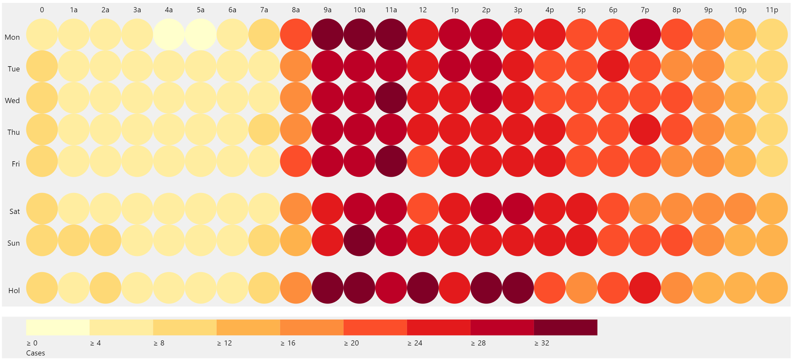
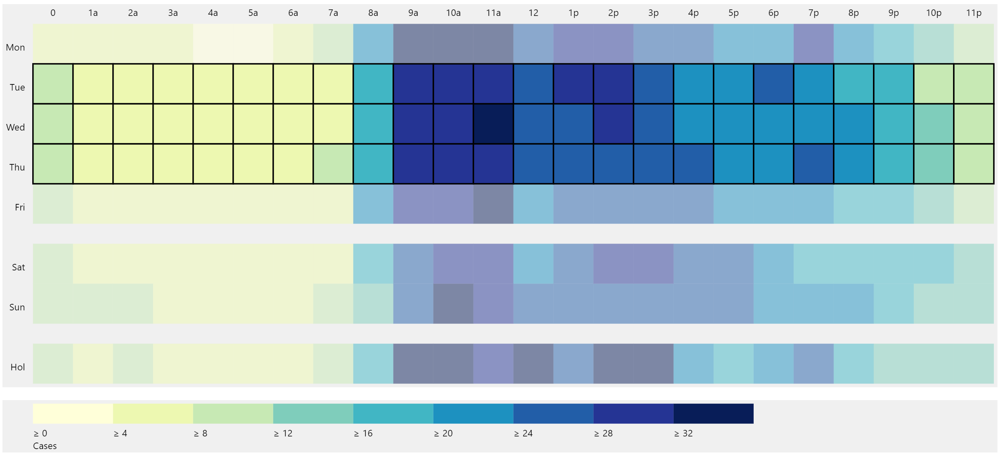
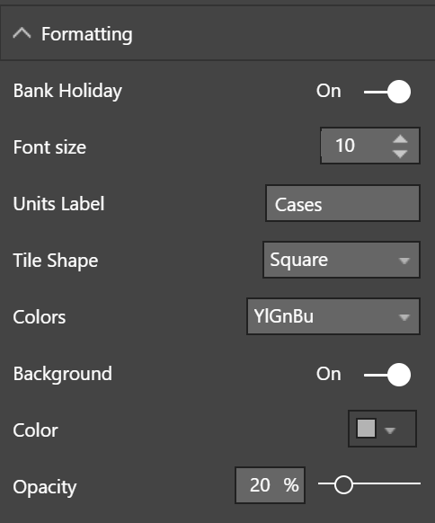

# powerBI-visual-Heatmap3
Power BI custom visual showing a day of week, hour of day heatmap

  

This custom visual for Microsoft Power BI displays a day of week, hour of day heatmap. The chart is a specific case of the generalised two dimensional heatmap where data is ordered by days and time of day. The visual supports:
+ Display of data by working days, weekends and bank holidays
+ Arrangement of time of day according to twenty four hour clock
+ Choice of background colours
+ Choice of colour schemes for data
+ Selectable data points. Multiple selections can be made by holding down the ctrl key. Entire rows and columns can be selected by clicking on the row and column labels.

**Configuration Options**

Sample data is included within the Sample Data folder.
